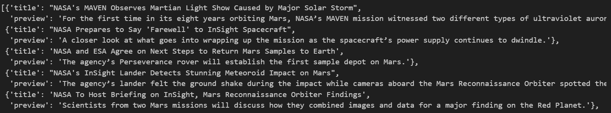
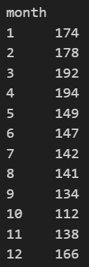
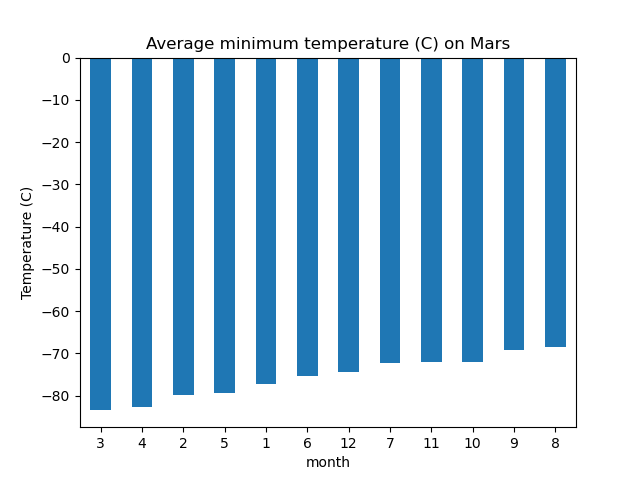
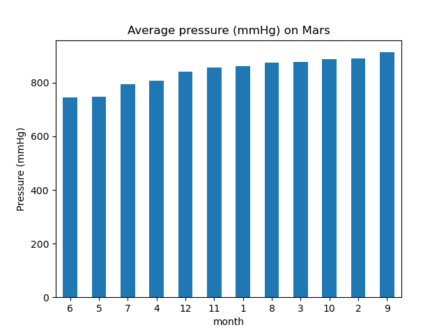
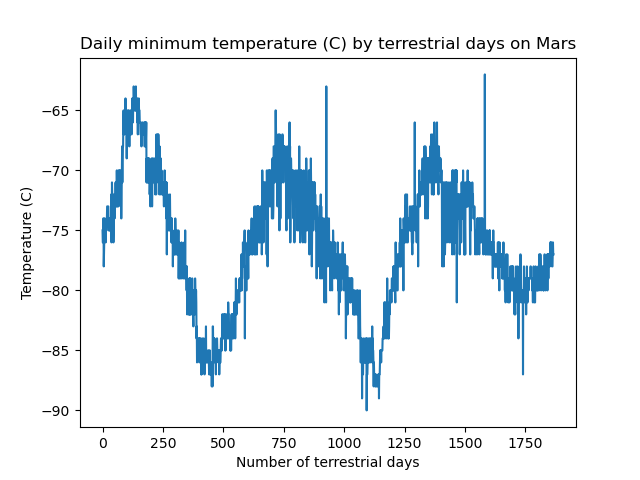

# html-scraping-challenge

## Part 1: Scrape Titles and Preview Text from Mars News

* Use automated browsing to visit the [Mars news site](https://static.bc-edx.com/data/web/mars_news/index.html)
* Create a Beautiful Soup object and use it to extract text elements from the website
* Extract the titles and preview text of the news articles that were scraped
* Store each title-and-preview pair in a Python dictionary  
  

## Part 2: Scrape and Analyse Mars Weather Data

### Background

* Use automated browsing to visit the [Mars Temperature Data Site](https://static.bc-edx.com/data/web/mars_facts/temperature.html)
* Create a Beautiful Soup object and use it to scrape the data in the HTML tab
* Assemble the scraped data into a Pandas DataFrame
* Cast (or convert) the data to the appropriate `datetime`, `int`, or `float` data types for data analysis

### Analysis & Results

1. **How many months exist on Mars?**  
    
2. **How many Martian (and not Earth) days worth of data exist in the scraped dataset?**  
    `1867`  
3. **What are the coldest and the warmest months on Mars (at the location of Curiosity)?**  
   On Mars, month 3 has the coldest minimum temperature with an average temperature of approx -83C while month 8 is the warmest month with an average temperature of approx -68C.  
    
4. **Which months have the lowest and the highest atmospheric pressure on Mars?**  
    On Mars, month 6 has the lowest average pressure (approx 745mmHg) while month 9 has the highest average pressure (approx 913mmHg).   
    
5. **About how many terrestrial (Earth) days exist in a Martian year?**  
    Using the peaks to estimate a year on Mars, the distance bewteen peak 1 and 2 is approximately 750-125 = 675 and the distance between peak 2 and peak 3 is approximately 1400-750 = 650. Approximately 650-675 Earth days is equivalent to 1 year on Mars.  
  

## References

* The Mars News [website](https://static.bc-edx.com/data/web/mars_news/index.html) is operated by edX Boot Camps LLC for educational purposes only. The news article titles, summaries, dates, and images were scraped from NASA's Mars News [website](https://mars.nasa.gov/) in November 2022. Images are used according to the [JPL Image Use Policy](https://www.jpl.nasa.gov/jpl-image-use-policy), courtesy NASA/JPL-Caltech.
* [Set dictionary key names and store value of list index](https://medium.com/geekculture/web-scraping-tables-in-python-using-beautiful-soup-8bbc31c5803e)
* [Sort index of dataframe as an integer](https://stackoverflow.com/questions/42648460/pandas-sort-index-as-an-integer)
* [Set column names after groupby aggregation in dataframe](https://medium.com/geekculture/mastering-groupby-aggregation-in-pandas-using-different-aggregated-functions-on-different-columns-9dca54b75961)
* [Remove legend on matplotlib figure](https://stackoverflow.com/questions/5735208/remove-the-legend-on-a-matplotlib-figure)
